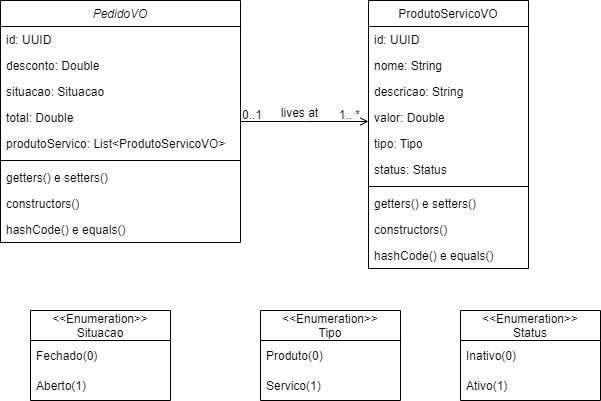

# backend_MS_Pedidos

Microserviço de cadastrar Pedido/Serviço e Pedido.

* Terá três entidades: Produto/Serviço, Pedido e Itens de Pedido.
* Todas as entidades deverão ter um ID únivo do tipo UUID.
* No cadastro de produto/serviço, deverá ter uma indicação para diferenciar um produto de um serviço.
* Deverá ser possível aplicar um percentual de desconto no pedido, porém apenas para os itens que sejam produto (não serviço). O desconto será sobre o valor total dos produtos  


* Somente será possivel aplicar o desconto se o pedido estiver na situação Aberto (Fechado bloqueia)
* Não deve ser possível excluir um produto/serviço se ele estiver associado a alguem pedido
* Não deve ser possível adiiconar em um pedido, um produto desativado.  

* Deverá ser possivel aplicar filtros na listagem
* As entidades deverão utilizar Bean Validation
* Deverá ser implementado um ControllerAdvice para customizar os HTTP response das requisições (minímo BAD REQUEST)  


Foi utilizado o padrão Value Object, desta forma, o modelo do banco é diferente daquele passado.
O modelo VO que deve ser passado via body (json) é:
  


## Para rodar um projeto maven com spring:
Se a IDE não tiver o ícone para rodar a aplicação, poderá rodar via terminal:
```sh
mvn clean compile spring-boot:run
```
ou simplesmente  
```sh
mvn spring-boot:run
```

#### configuração:
O MS de produto foi configurado para rodar na porta 8080, o de Pedido na 8081 e no de pedido-produto na 8082.
Não foi impletado o api gateway, nem loader balancer, por exemplo.


## Nome do banco de dados:
Foi configurado para acessar o banco de dados Postgresl na porta padrão com o nome **backend**

### Endpoint para cadastro de produto/serviço

| endpoint | HTTP|Descrição |
|----------|-----|-----------|
|/v1/produto-servico| POST | Salvar um Produto no banco - requer um body do produto|
|/v1/produto-servico| PUT | Atualizar um produto no banco - requer um body do produto|
|/v1/produto-servico/:id| GET | Busca um produto pelo id, que é passado como Path Variable na url|
|/v1/produto-servico| GET | Busca todos os produtos do banco|
|/v1/produto-servico/:id| DELETE | Deleta um produto pelo id, que é passado como Path Variable na url|
|/v1/produto-servico/search| GET| busca uma lista de produtos de acordo com o nome, é aceito os Request param 'searchTerm', 'page' e 'size' para fazer a paginação. O searchTerm deve ser o nome do produto/servico|
|/v1/produto-servico/pagination| GET | busca todos os produtos do banco de acordo com a paginação passada (objeto Pageable)|

## Endpoint para cadastro de Pedido (e item-pedido)

| endpoint | HTTP|Descrição |
|----------|-----|-----------|
|/v1/pedido| POST |Salva um pedido no banco, requer um body|
|/v1/pedido| PUT | Atualiza um pedido no banco, requer um body|
| /v1/pedido/:id | GET | Busca um pedido no banco de acordo com o id, que é passado como Path Variable na url|
|/v1/pedido| GET | Busca todos os pedidos no banco|
|/v1/pedido/:id| DELETE | Deleta o pedido no banco de dados de acordo com o id, que é passado como Path Variable na url|
|/v1/pedido/search| GET| busca uma lista de produtos de acordo com o desconto, que é passado como Request Param 'searchTerm', é permitido passar também os Request Param 'page' e 'size' para fazer a paginação. O searchTerm deve ser o valor do desconto.|
|/v1/pedido/pagination| GET | Busca todos os pedidos no banco de acordo com a paginação passada (objecto Pageable)|

## Endpoint para cadastro direto no item-pedido:
| endpoint | HTTP|Descrição |
|----------|-----|-----------|
|/v1/itens-order| POST |Salva um pedido no banco, requer um body|
|/v1/itens-order| PUT | Atualiza um pedido no banco, requer um body|
| /v1/itens-order/:id | GET | De acordo com o id, busca um pedido com seus itens no banco, que é passado como Path Variable na url|
|/v1/itens-order| GET | Busca todos os itens-pedido no banco|
|/v1/itens-order/:id| DELETE | Deleta o pedido no banco de dados de acordo com o id, que é passado como Path Variable na url|

### Exemplo de body do produto:
```sh
{
    "nome": "teclado gamer pro 3",
    "descricao": "teclado gamer 3",
    "valor": 120,
    "tipo": 0,
    "status": 1
}
```

### Exemplo de body do pedido:
```sh
{
    "desconto": 10,
    "situacao": 1,
    "produtoServico": [
        {
            "id": "4cd9b09e-b7c7-442d-b952-a8c6a9895897"
        },
        {
            "id" : "3ea56436-cf56-46e7-b9e6-27a1db71a536"
        },
        {
            "id": "59cd5f8d-cbfb-41c9-9fc2-0918bb28c3a4"
        },
        {
            "id": "f2a6fa10-3335-4694-9219-08c18b564cfc"
        }
    ]
}
```


### Exemplo de body do item-pedido:
```sh
{
    "idPedido" : "e11573bd-b634-40a5-9431-ab02d33be37c",
    "idProdutoServico" : [
        "f2df9367-9ab5-454a-968b-7bfd7cfb50df",
        "e789c033-140c-484c-ac2a-832921968753"
    ]
}
```

### Exemplo dos get com paginação
-> Produto:
1) Get com filtro (nome do produto) e paginação
```sh
localhost:8080/v1/produto-servico/search?searchTerm=teclado&page=0&size=3
```
retorno esperado:
```sh
{
    "content": [
        {
            "id": "23ea840a-766c-450a-b857-d257835644b9",
            "nome": "teclado ultra 6",
            "descricao": "teclado ultra 350/6",
            "valor": 80.0,
            "tipo": "0",
            "status": "1"
        },
        {
            "id": "2586dabb-7d6d-4a56-a322-650b5c39c731",
            "nome": "teclado gamer",
            "descricao": "teclado gamer 1",
            "valor": 100.0,
            "tipo": "0",
            "status": "1"
        },
        {
            "id": "423b453b-1c5b-4053-bdc2-b4171abbc9b6",
            "nome": "teclado ultra 10",
            "descricao": "teclado ultra 350/10",
            "valor": 100.0,
            "tipo": "0",
            "status": "1"
        }
    ],
    "pageable": {
        "sort": {
            "empty": false,
            "unsorted": false,
            "sorted": true
        },
        "offset": 0,
        "pageNumber": 0,
        "pageSize": 3,
        "paged": true,
        "unpaged": false
    },
    "last": false,
    "totalPages": 4,
    "totalElements": 11,
    "size": 3,
    "number": 0,
    "sort": {
        "empty": false,
        "unsorted": false,
        "sorted": true
    },
    "first": true,
    "numberOfElements": 3,
    "empty": false
}
```

2) Get com paginação (mas usando a interface Pageable)
```sh
localhost:8080/v1/produto-servico/pagination?page=0&size=5
```
retorno esperado:
```sh
{
    "content": [
        {
            "id": "23ea840a-766c-450a-b857-d257835644b9",
            "nome": "teclado ultra 6",
            "descricao": "teclado ultra 350/6",
            "valor": 80,
            "tipo": "0",
            "status": "1"
        },
        {
            "id": "2586dabb-7d6d-4a56-a322-650b5c39c731",
            "nome": "teclado gamer",
            "descricao": "teclado gamer 1",
            "valor": 100,
            "tipo": "0",
            "status": "1"
        },
        {
            "id": "3ea56436-cf56-46e7-b9e6-27a1db71a536",
            "nome": "Manutenção",
            "descricao": "Manutenção no laptop",
            "valor": 250,
            "tipo": "1",
            "status": "1"
        },
        {
            "id": "423b453b-1c5b-4053-bdc2-b4171abbc9b6",
            "nome": "teclado ultra 10",
            "descricao": "teclado ultra 350/10",
            "valor": 100,
            "tipo": "0",
            "status": "1"
        },
        {
            "id": "4cd9b09e-b7c7-442d-b952-a8c6a9895897",
            "nome": "teclado",
            "descricao": "teclado",
            "valor": 100,
            "tipo": "0",
            "status": "1"
        }
    ],
    "pageable": {
        "sort": {
            "empty": false,
            "unsorted": false,
            "sorted": true
        },
        "offset": 0,
        "pageNumber": 0,
        "pageSize": 5,
        "paged": true,
        "unpaged": false
    },
    "last": false,
    "totalPages": 4,
    "totalElements": 16,
    "size": 5,
    "number": 0,
    "sort": {
        "empty": false,
        "unsorted": false,
        "sorted": true
    },
    "first": true,
    "numberOfElements": 5,
    "empty": false
}

```
